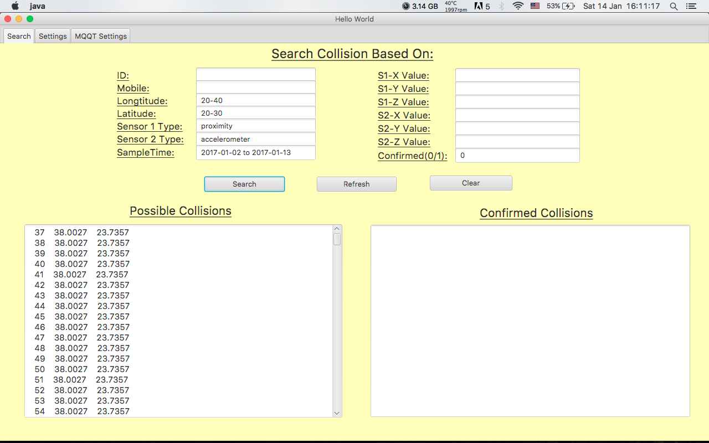
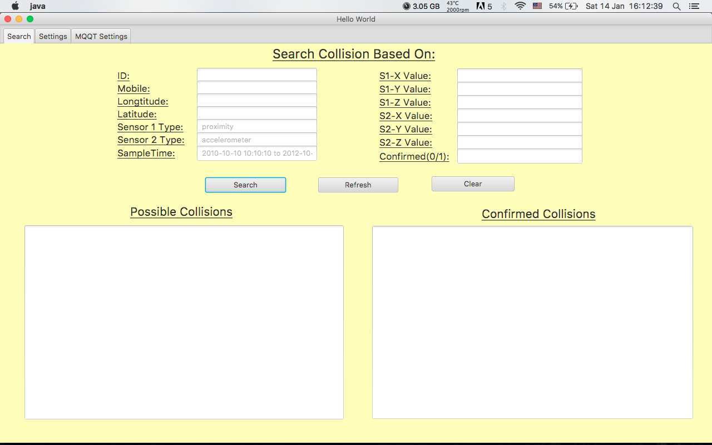
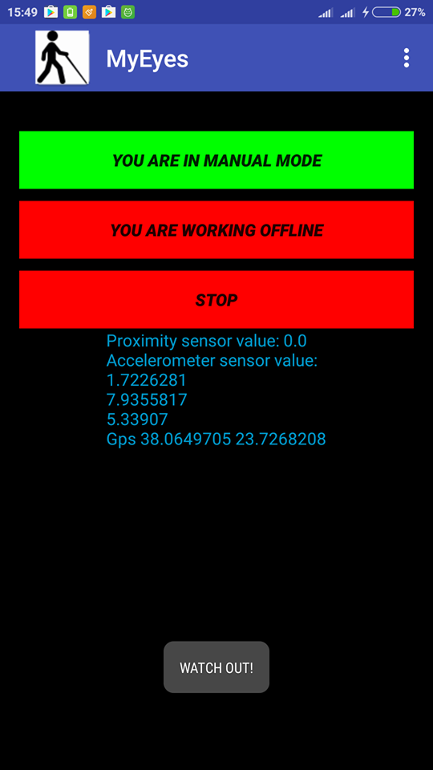
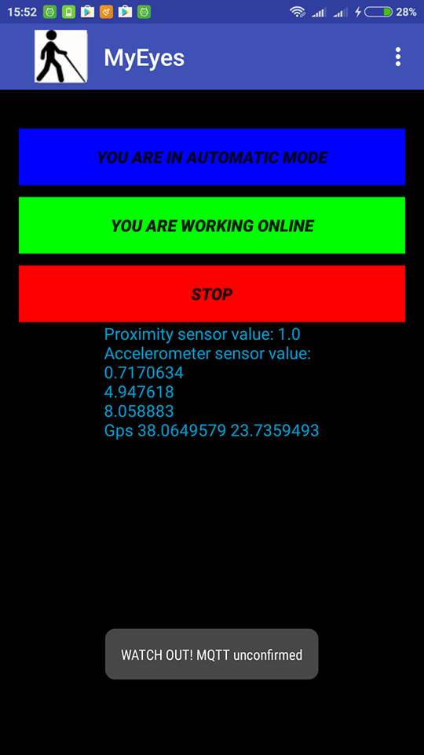

<h1> K23B - Δεύτερο Παραδοτέο </h1>

<h6> Android Application </h6>

Η εφαρμογή υλοποιεί ένα σύστημα ανίχνευσης συγκρούσεων πεζών
χρησιμοποιώντας δύο αισθητήρες.Συγκεκριμένα,τον accelerometer sensor και
τον proximity sensor.Μόλις η τιμή ενός εκ των δύο αισθητήρων περάσει
μια συγκεκριμένη τιμή (κατώφλι) τότε ενεργοποιείται ηχητικό και
εικονικό μήνυμα (toast) που προειδοποιεί για πιθανή σύγκρουση με άλλο
αντικείμενο.

 Η κλάση MainActivity δημιουργεί το activity που εκτελείται με την εκκίνηση της
εφαρμογής με την onCreate(),η οποία ορίζει το γραφικό της περιβάλλον και δημιουργεί
τρία κουμπιά,δημιουργεί το Options Menu με την μέθοδο onCreateOptionMenu(),
εκτελεί τις αντίστοιχες ενέργεις onOptionsItemSelected() ανάλογα την επιλογή μας,
κλείνει την εφαρμογή με την onBackPressed(),λαμβάνει τα αποτελέσματα με την onActivityResult()
και καταστρέφεται με την onDestroy().

Η κλάση SettingsActivity περιέχει τις ρυθμίσεις για τα κατώφλια των αισθητήρων.
Με την onCreate() δημιουργείται και βάζει αρχικές τιμές στα πεδία της.Η onSaveInstanceState()
αποθηκεύει τα δεδομένα στο bundle και η onRestoreInstanceState() περνάει τις νέες ρυθμίσεις στη
main activity.

Η AboutActivity περιέχει μία σύντομη περιγραφή της εφαρμογής και απλώς καθορίζει το
γραφικό της περιβάλλον όταν δημιουργείται.

Η κλάση AccelerometerSpy ανάλογα αν εργαζόμαστε σε online mode δημιουργεί με την μέθοδο
 genToneMqtt() ηχητικό μήνυμα για προειδοποίηση σύγκρουσης και αν είμαστε σε offline mode
δημιουργεί με την genTone() το ηχητικό μήνυμα.Τα τερματικά κάνουν publish στον broker με την μέθοδο 
publish().H onSensorsChanged() εκτελείται όταν αλλάζουν οι τιμές των αισθητήρων και ελέγχει αν είμαστε σε
manual/automatic mode.Επίσης ανάλογα αν βρισκόμαστε εντός ή εκτός σύνδεσης εκτελεί τις απαραίτητες
ενέργειες για να αποφασίσει αν υπάρχει σύγκρουση.Τέλος η messageArrived() εμφανίζει κατάλληλο
εικονικό και ηχητικό μήνυμα,ανάλογα το είδος της σύγκρουσης(πιθανή ή επιβεβαιωμένη).

Με την κλάση ChoiceMaker() στη μέθοδο useMqtt(),διακρίνουμε σε 8 περιπτώσεις και αποφασίζουμε
 αν τελικά η εφαρμογή θα τρέξει σε online ή offline mode.

H κλάση GpsSpy παρακολουθεί τις συντεταγμένες του κινητού.

Η κλάση SensorController παρακολουθεί τις τιμές των αισθητήρων.Αρχικοποιεί τους αισθητήρες
με την init(),ξεκινά την παρακολούθηση με την start(),την σταματά με την stop() και τέλος
έχει τον κώδικα για το subscribe() και unsubscribe() ενός τερματικού σε ένα τόπικ του broker.
Η κλάση SensorNameSpace χρησιμοποιείται για να γίνει ο Sensor Controller προσβάσιμος απο όλα τα σημεία της
Android εφαρμογής.

Η κλάση CurrentState υποδυκνείει τις αλλαγές που κάνει ο χρήστης απο τα Settings
στην περίοδο δειγματοληψίας και το κατώφλι των αισθητήρων
και για αυτό περνιέται ως παράμετρος από τη main activity
στο settings activity και αντιστρόφως καθώς και όταν αλλάζει το
orientation αυτών των activities.

Η κλάση MobileState επιστρέφει το αναγνωριστικό του Android τερματικού.

Οι κλάσεις AcceleratorSpy και ProximitySpy παρακολουθούν και ενημερώνουν
τις τιμές των αισθητήρων και ο SensorController ενεργοποιεί και
απενεργοποιεί τους αισθητήρες με τη βοήθεια του SensorManager(sMgr)

Η κλάση StartStopListener παρακολουθεί και δρα ανάλογα το πάτημα του κουμπιού
Start-Stop της Main Activity.H Η κλάση ManualAutomaticListener παρακολουθεί και δρα
ανάλογα το πάτημα του κουμπιού Manual-Automatic της Main Activity.
Η κλάση OnlineOfflineListener ανταποκρίεται στο κουμπί Online-Offline Mode 
της Main Activity.

Η επιλογή Exit του Options Menu υλοποιείται από την κλάση ExitDialog
που έχει τους OkListener και CancelListener,ανάλογα το κουμπί που επιλέγει ο χρήστης.

Η κλάση ButtonApplyListener αποθηκεύει τις αλλαγές που κάνει ο χρήστης στα Settings,
δηλαδή στις τιμές των κατωφλιών και της δειγματοληψίας και ενημερώνει με
κατάλληλο toast αν η ενήμερωση πέτυχε ή απέτυχε.

<h6> Java Application </h6>

Το δεύτερο κομμάτι της εργασίας αποτελεί επέκταση του πρώτου παραδοτέου.
Για την ανάπτυξη της Java εφαρμογής και για το γραφικό της περιβάλλον σε JavaFX
χρησιμοποιήθηκε το εργαλείο Intellij IDEA και για την επέκταση της Android εφαρμογής
χρησιμοποιήθηκε το Android Studio.Ο σχεδιασμός της βάσης έγινε με το εργαλείο
MySQL Workbench και ως διαμεσολαβητής των Android τερματικών χρησιμοποιήθηκε
ο MQTT Mosquitto Broker με τις υλοποιήσεις του Eclipse Paho και για τη σύνδεση με
τη βάση δεδομένων χρησιμοποιήθηκε επίσης το API JDBC.

Η επέκταση της Android εφαρμογής βρίσκεται στο project1 του gitlab
και η java εφαρμογή βρίσκεται στο project2.

Στο pom.xml βρίσκονται σημαντικές παράμετροι και ρυθμίσεις της εφαρμογής
και δηλώνονται κάποιες επεκτάσεις και υλοποιήσεις που θα χρησιμοποιήσει η εφαρμογή όπως
τα εργαλεία Eclipse Paho και Maven

Η κλάση Main  ορίζει το γραφικό περιβάλλον που θα εκτελεστεί( start() ) και δημιουργεί και τρέχει
ένα thread( main() ).

Στο πακέτο connectdb , η κλάση ConnectDb με τη μέθοδο getConnection() ορίζει τις παραμέτρους που
 απαιτούνται για να συνδεθούμε με τη βάση δεδομένων και δημιουργεί τη νέα σύνδεση,
η κλάση QueryDb εκτελεί τα Queries προς τη βάση με την SelectQuery() και παίρνει τα δεδομένα από τη
βάση.Κάνει τροποποιήσεις,ενημερώσεις και διαγραφές με την DoQuery() και με την CloseResources()
διακόπτει τη σύνδεση με τη βάση.Η κλάση Crash εκτός από τον constructor της Crash() που αρχικοποιεί τα πεδία της,
έχει τη μέθοδο load() πού επιστρέφει τα δεδομένα τις βάσεις που εισάγει ο χρήστης και τα αποθηκεύει
στο αντίστοιχο πεδίο της βάσης και διαμορφώνει το query.Με την μέθοδο insert() εισάγει τη νέα γραμμή στη
βάση,με την update() ενημερώνει τη βάση δεδομένων,με τη getLastDate() παίρνει ημερομηνία σύγκρουσης και με τη
getLastID() το αναγνωριστικό του τερματικού.

Η κλάση Controller του πακέτου gui περιέχει τις ενέργειες που γίνονται,όταν στο γραφικό περιβάλλον 
της εφαρμογής πατηθεί κάποιο από τα κουμπιά.Με τη μέθοδο initialize αρχικοποιούνται τα πεδία εισόδου
σε κάποιες προκαθορισμένες τιμές,η handleSubmitSearchAction() πραγματοποιεί αναζήτηση και εμφανίζει τα
αποτελέσματα σε 2 TextAreas ανάλογα αν η σύγκρουση είναι επιβεβαιωμένη ή πιθανή,η handleSubmitApplySettingChangesAction()
αποθηκεύει τις αλλαγές στα κατώφλια των αισθητήρων,η handleSubmitApplyMqttSettingChangesAction() αποθηκεύει
τα τοπικς που θα στέλνονται τα μηνύματα στον broker και η handleSubmitClearAction() καθαρίζει τα πεδία αναζήτησης.

Η κλάση CurrentState περιέχει τα κατώφλια των αισθητήρων των Android τερματικών
και τα IP και Port του MQTT και όλα τα σχετικά ζευγάρια setters/getters.

Στο πακέτο threads βρίσκεται το thread της εφαρμογής ή η κλάση ComputationalServiceRunnable για τη λειτουργία
 διαφορετικών tasks όπως τα subscribe(),unsubscribe() και publish() των τερματικών στον Mqtt Broker,ο έλεγχος της σύγκρουσης 
με βάση τα κατώφλια των αισθητήρων μέσω της compute() αλλά και τη χρονική διαφορά μεταξύ των δύο κινητών για να
 συμπεράνουμε αν η σύγκρουση είναι πιθανή ή επιβεβαιωμένη και εισάγει τη νέα σύγκρουση στη βάση μέσω της messageArrived().

Η Βάση αποτελείται από έναν πίνακα με όνομα "crash" ο οποίος περιέχει 14 στήλες (ενα id για το πίνακα primary key, 
και οι άλλες που θα εισάγονται τα στοιχεία από το publish των κινητών μέσα από το mosquitto server. 
Αναλυτικά έχουμε τις εξής στήλες :
· mobile - ποιο κινητό στέλνει τα δείγματα
· longtitude - γεωγραφικό μήκος κινητού
· latitude - γεωγραφικό πλάτος κινητού
· sensortype1 - είναι ο αισθητήρας proximity
· sensor1valuex - η τιμή x του proximity (0 η 1)
· sensor1valuey - η τιμη y του proximity (δεν τη χρησιμοποιουμε για την ωρα αλλα ειναι καλο να υπαρχει αν πληροφορια 
αφου ετσι και αλλιως ερχεται σαν διανυσμα απο το λειτουργικο)
· sensor1valuez - η τιμή z του proximity (δεν τη χρησιμοποιουμε για την ωρα αλλα ειναι καλο να υπαρχει αν πληροφορια 
αφου ετσι και αλλιως ερχεται σαν διανυσμα απο το λειτουργικο)
· sensortype2 - είναι ο αισθητήρας accelerometer
· sensor2valuex -η επιτάχυνση στον άξονα χ'χ  του κινητού
· sensor2valuey  - η επιτάχυνση στον  άξονα y'y του κινητού
· sensor2valuez -η επιτάχυνση στον άξονα z'z του κινητού 
· sampletime - η ημερομηνία καταχώρησης
· confirmed - boolean τιμή σύγκρουσης (1 αν έχουμε επιβεβαιωμένη σύγκρουση, 0 αν όχι).
Η σύνδεση στη βάση γίνεται μέσω της κλάσης "ConnectDb" στο IntelliJ και η είσοδος δεδομένων στη βάση γίνεται στη κλάση "ComputationalServiceRunnable" . Η ανάκληση δεδομένων απο την βάση μέσω του search στο Admin Tab στο run του intellij 
γίνεται μέσω της κλάσης "Crash".

 Ένα Android τερματικό κάνει publish στον Mqtt broker στο τόπικ που έχει όνομα το ID του για να στείλει στον broker
τα στοιχεία του σε περίπτωση πιθανής σύγκρουσης.Συγκρεκριμένα το ένα τερματικό κάνει στο "2204694f62075e08" και το άλλο στο "6f51888c3715cd1d".Το subscribe και των δύο κινητών γίνεται στο τόπικ "MQTT" όπου λαμβάνουν μηνύματα για σύγκρουση.
Απο την πλευρά της Java εφαρμογής γίνεται η αντίθετη διαδικασία.Δηλαδή το thread ComputationalServiceRunnable 
κάνει subscribe στα 2 τόπικς με όνομα τα ID των δύο κινητών για να παίρνει τις τιμές των αισθητήρων και τα στοιχεία των
τερματικών και κάνει publish στο topic "MQTT" για να προωθεί τα μηνύματα σύγκρουσης στον broker από όπου θα τα λάβουν
τα δύο κινητά.Σημειώνεται ότι σε περίπτωση επιβεβαιωμένης σύγκρουσης το thread προωθεί το μήνυμα "collision" αλλιώς
άμα είναι πιθανή στέλνει το ID του τερματικού.

Κάποιες παραδοχές σχετικά με την άσκηση:

Υλοποιήθηκε μόνο ενα thread για την εκτέλεση όλων των διαφορετικών tasks.

Στο γραφικό περιβάλλον η λίστα των αποτελεσμάτων δεν υποστηρίζει σελιδοποίηση,
δεν χρησιμοποιήθηκαν διαφορετικά χρώματα για τις πιθανές και επιβεβαιωμένες συγκρούσεις
αλλά δύο διαφορετικά TextAreas και τέλος προστέθηκε και 3ο tab για τα settings του Mqtt.

